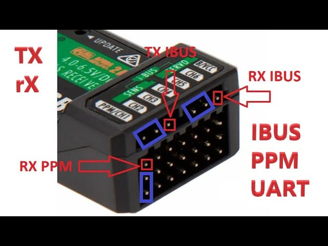

# FS-IA6B
## Protocole
La télécommande FS-IA6B possède 3 types de protocole. Le premier s'appelle le **PWM** (Pulse Width Modulation) et ne peut pas être fonctionnable sur du linux embarqué. Le second, appelé **PPM** (Pulse Position Modulation) possède le même problème. Pour cela, un dernier protocol appelé **UART** permet de récupérer les valeurs par les broches RX de la raspberry PI. Ce sont des valeurs binaires envoyer par octet par le receveur avec un *header* spécifique et un *footer*.

### Headers et Footer
Le header se compose de 2 octets avec comme valeurs hexadécimales **0x20** et **0x40**. Ensuite 28 octets de données sont envoyés pour les 14 channels du récepteur. Finalement, un footer sur deux octets est envoyé. Ce footer, appelé un checksum, permet de vérifier l'intégrité des données en mettant en place un algorithme. 

Ici l'algorithme est mis en place tel que nous soustrayons à **0xFFFF** les valeurs de tous les données (excepté le footer lui-même). En calculant nous aussi la valeur du checksum, nous sommes en mesure de connaître l'intégrité des données.

### Les données
Les données sont rangés par deux octets dans un format appelé (little endian). Par exemple: **0xDC** **0x05** -> **0x05DC**.
Une fois regroupé, on peut facilement en retirer les valeurs en les convertissant en entier 16 bits.

### Communication avec le serveur
Les données traitées par le programme sont ensuite envoyer sur l'exchange `amqp.topic` du serveur local à l'orange pi (`localhost`). Pour l'instant, seulement les valeurs des cannaux 0 et 2 (respectivement profondeur et thrust) sont envoyé sur l'exchange avec les binding key suivantes :
- canal 0 (profondeur) -> angle.nnMap
- canal 2 (thrust)     -> speed.nnMap

## Le code

Pour faire fonctionner le code, il faut connaître le fichier Linux permettant de récupérer les valeurs UART. Sur la raspberry pi 2B, la valeur est `/dev/serial0`, et sur l'orange pi zero 2W, la valeur est `/dev/ttyAS5`.
Une fois ceci fait, le programme va recevoir les données, vérifier leurs intégrités, et remplir une structure passée en paramètre que l'utilisateur pourra lire.

La manette FlySky en notre possession contient 6 channels. Les valeurs 0 à 5 de notre structure suivante:
`
struct IBusChannels{
    uint16_t channels[14]; 
};
`

Les valeurs reçues ne sont pas mappées. 

Pour avoir un exemple d'utilisation, le repository **Manoeuvre** montre un programme appelé <ins>"FS_IA6Bmain.cpp"</ins>